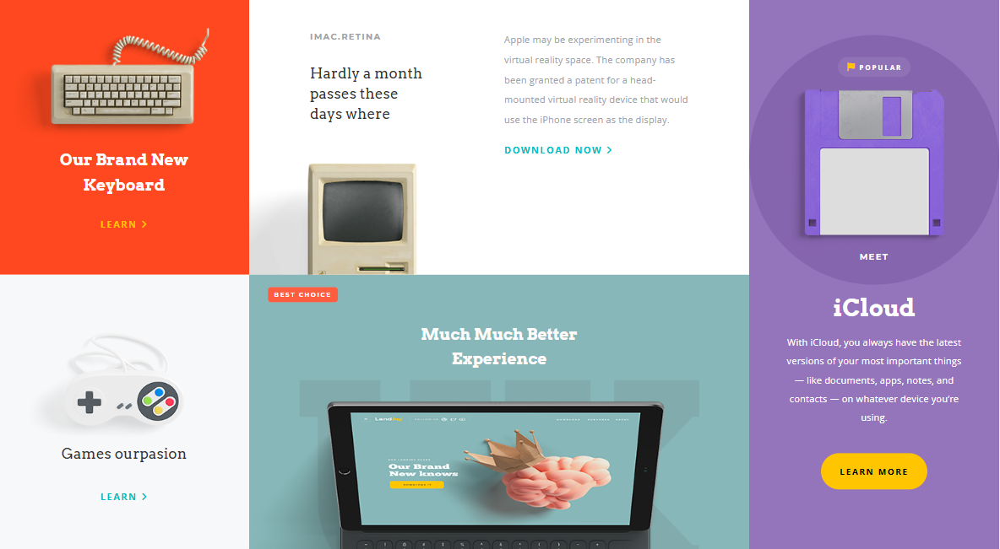

## 📌 Grid Masterclass  

This project is a **CSS Grid masterclass practice** where I explored different grid layouts and techniques.  
It focuses on building responsive, modern layouts using only **HTML5** and **CSS3 Grid**.  

### 🔹 Features  
- Practiced advanced **CSS Grid properties** (grid-template-areas, etc.)  
- Fully **responsive layout** across devices  
- Clean and reusable code for layout structures  
- A showcase of design flexibility with Grid  

### 🎯 Purpose  
The main goal of this project is to strengthen my skills in **CSS Grid** and layout design, creating a solid foundation for building scalable and responsive web applications.  

### 🔍 Preview  

